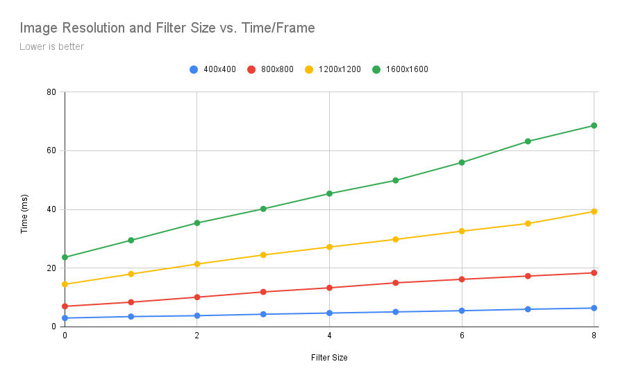

# CUDA Denoiser For CUDA Path Tracer

**University of Pennsylvania, CIS 565: GPU Programming and Architecture, Project 4**

* Aditya Gupta
  * [Website](http://adityag1.com/), [GitHub](https://github.com/AdityaGupta1), [LinkedIn](https://www.linkedin.com/in/aditya-gupta1/), [3D renders](https://www.instagram.com/sdojhaus/)
* Tested on: Windows 10, i7-10750H @ 2.60GHz 16GB, NVIDIA GeForce RTX 2070 8GB (personal laptop)
  * Compute capability: 7.5

## Introduction

This project is a CUDA implementation of [Edge-Avoiding À-Trous Wavelet Transform for fast Global Illumination Filtering](https://jo.dreggn.org/home/2010_atrous.pdf), a denoising method for path tracers. This method involves using successive blurs of increasing size while weighting based on differences in color, position, and normals. The above images show a comparison of the raw path traced output at 100 spp (left) and the denoised version (right).

## Features

The GUI has controls for enabling denoising, setting the filter size, changing weight parameters, and outputting the G-buffer.

## Performance Analysis

### Image Resolution and Filter Size vs. Time/Frame

I first compared the path tracer's performance across multiple resolutions and denoising filter sizes. A filter size of 0 means denoising was disabled. A filter size of $k \geq 1$ means the filter ran $k$ times per path tracing iteration, and for each filter iteration $i$ such that $1 \leq i \leq k$, the filter kernel covered $5 \cdot 2^{i - 1}$ pixels in each direction.

From this graph, we can see that for all tested resolutions, the time per frame increases linearly with the number of filter iterations.

### Filter Size vs. Image Quality

This brings up a question: does an increased filter size necessarily mean better results? Here are some test images:

| Filter Size | Image |
|-------------|-------|
| None        |  |
| 1           |  |
| 3           |  |
| 5           |  |
| 7           |  |

### Qualitative Analysis